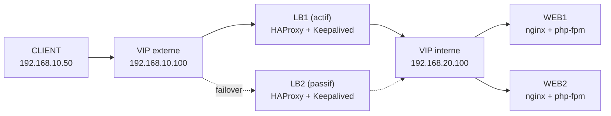

<div align="center">

# 🛡️ TP Haute Disponibilité — NovaSanté

**Architecture redondée, bascule automatique & conformité NIS2 / RGPD**

[](#)
[](#)
[](#)
[](#)
[](#)

</div>

---

## 📑 Sommaire

- [Contexte](#-contexte)
- [Objectifs du TP](#-objectifs-du-tp)
- [Architecture cible](#-architecture-cible-virtualbox--5-vm)
- [Plan d'adressage](#-plan-dadressage-synthétique)
- [Schéma logique](#-schéma-logique)
- [Arborescence du dépôt](#-arborescence-attendue)
- [Documents normalisés](#-documents-normalisés)
- [Vérification rapide](#-vérification-rapide)
- [Auto-évaluation](#-auto-évaluation-documentation)

---

## 📌 Contexte

Ce dépôt contient le TP de **B1 — Administrer et sécuriser les infrastructures**.

Le scénario métier cible la société fictive **NovaSanté**, plateforme de prise de rendez-vous médicaux, soumise à de fortes exigences de :

| Exigence | Description |
|---|---|
| 🟢 **Continuité de service** | Le service doit rester disponible malgré la panne d'un composant |
| 🔒 **Sécurité** | Durcissement réseau et système sur l'ensemble des nœuds |
| ⚖️ **Conformité NIS2** | Gestion des risques et résilience des services essentiels |
| 🇪🇺 **Conformité RGPD** | Protection des données de santé des patients |

---

## 🎯 Objectifs du TP

- ✅ Garantir la disponibilité d'un service web malgré la panne d'un nœud critique
- ✅ Mettre en place une architecture redondée avec bascule automatique
- ✅ Produire des preuves mesurables : disponibilité, latence, RTO, RPO
- ✅ Documenter l'exploitation, les incidents et la conformité

---

## 🏗️ Architecture cible (VirtualBox · 5 VM)

| VM | Rôle | Composants |
|---|---|---|
| `LB1` | Load Balancer principal | HAProxy · Keepalived · nftables |
| `LB2` | Load Balancer secondaire | HAProxy · Keepalived · nftables |
| `WEB1` | Serveur applicatif | nginx · php-fpm · nftables |
| `WEB2` | Serveur applicatif | nginx · php-fpm · nftables |
| `CLIENT` | Poste de tests | Scripts de mesure et de supervision |

---

## 🌐 Plan d'adressage synthétique

**Réseaux**

| Segment | Plage |
|---|---|
| Client ↔ LB | `192.168.10.0/24` |
| LB ↔ WEB | `192.168.20.0/24` |
| Cluster VRRP | `10.99.99.0/24` |

**Adressage détaillé**

| Rôle | IP(s) |
|---|---|
| LB1 | `192.168.10.11` · `192.168.20.11` · `10.99.99.11` |
| LB2 | `192.168.10.12` · `192.168.20.12` · `10.99.99.12` |
| WEB1 | `192.168.20.21` |
| WEB2 | `192.168.20.22` |
| CLIENT | `192.168.10.50` |
| **VIP externe** | `192.168.10.100` |
| **VIP interne** | `192.168.20.100` |

---

## 🔀 Schéma logique



> Flux nominal : `CLIENT → VIP externe → LB actif (HAProxy) → WEB1 / WEB2`
> En cas de panne du LB actif, **Keepalived** bascule la VIP vers le LB passif via **VRRP**, sans interruption perçue côté client.

---

## 📂 Arborescence attendue

```
.
├── configs/    # Configurations par VM (HAProxy, Keepalived, nginx, nftables...)
├── scripts/    # Scripts de test et d'exploitation
├── mesures/    # Mesures brutes (CSV) : disponibilité, latence, RTO, RPO
└── docs/       # Documentation complète normalisée (tp-ha-*)
```

---

## 📄 Documents normalisés

| Fichier | Contenu |
|---|---|
| `docs/tp-ha-01-architecture.md` | Architecture générale de la solution |
| `docs/tp-ha-02-plan-adressage.md` | Plan d'adressage et matrice de flux |
| `docs/tp-ha-03-plan-de-tests.md` | Stratégie et scénarios de test |
| `docs/tp-ha-04-pv-tests.md` | Procès-verbaux de tests |
| `docs/tp-ha-05-pv-incidents.md` | Procès-verbaux d'incidents |
| `docs/tp-ha-06-exploitation.md` | Procédures d'exploitation |
| `docs/tp-ha-07-spof-residuels.md` | Analyse des SPOF résiduels |
| `docs/tp-ha-08-securite-conformite.md` | Sécurité et conformité NIS2 / RGPD |

---

## ⚡ Vérification rapide

Depuis la VM `CLIENT`, exécuter :

```bash
bash scripts/check-dispo.sh http://192.168.10.100 60 2
```

> Ce script interroge la VIP externe pendant 60 secondes avec un intervalle de 2 secondes, et permet de vérifier la disponibilité du service ainsi que la bascule automatique.

---

## ✅ Auto-évaluation (documentation)

| Critère | État |
|---|:---:|
| Contexte métier et réglementaire explicités | ✅ |
| Objectifs techniques explicites | ✅ |
| Schéma / chaîne de flux présent | ✅ |
| Plan d'adressage complet + matrice de flux | ✅ |
| Plan de tests, PV tests et PV incidents fournis | ✅ |
| Procédures d'exploitation + SPOF résiduels | ✅ |
| Mesures disponibilité / latence / RTO / RPO fournies | ✅ |
| Nomenclature documentaire unifiée | ✅ |

---

<div align="center">

*Dépôt pédagogique — TP Haute Disponibilité — B1 Administrer et sécuriser les infrastructures*

</div>
